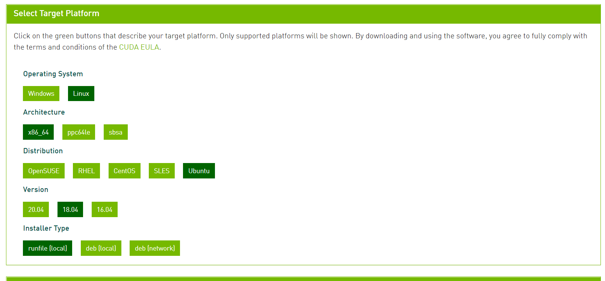

# 如何安装cuda、cuDNN

##  NVIDIA驱动程序安装
*对于新机器，需要检查有没有安装其他的显卡驱动程序，如果有，则需要全部清理，重新安装官方驱动！！！*
```
lshw -numeric -C display #查看当前电脑的显卡型号 

lsmod | grep nouveau #查看nouveau驱动是否使用 

lspci | grep VGA # 查看集成显卡 

lspci | grep NVIDIA # 查看NVIDIA显卡
```

**禁用nouveau驱动**
禁用之后重新启动机器`reboot`

**清理之前安装的NVIDIA的驱动**
`sudo apt-get remove –purge nvidia`
完成清理之后重启机器

安装Ubuntu源的nvidia驱动，如430版本
`sudo apt install nvidia-driver-430`
安装完之后，执行
`nvidia-smi`
查看输出信息

## cuda安装


选择下载runfile文件安装方式直接执行，eg：
```
wget https://developer.download.nvidia.com/compute/cuda/11.0.3/local_installers/cuda_11.0.3_450.51.06_linux.run
sudo sh cuda_11.0.3_450.51.06_linux.run
```
根据提示，安装完成以后，添加相应的系统环境变量
```
sudo vim ~/.bashrc
#添加以下内容：
	#CUDA_HOME是系统默认安装路径，当然具体以你选择的安装路径为准
    export CUDA_HOME=/usr/local/cuda-10.0 #根据自己安装的版本号
    export LD_LIBRARY_PATH=${CUDA_HOME}/lib64
    export  PATH=${CUDA_HOME}/bin:${PATH}
```
当然也可以给我们安装的cuda包创建链接，一般默认是硬链接
eg:
```
sudo ln /usr/local/cuda10.0 /usr/local/cuda
```

## cuDNN 安装

cudnn下载地址：https://developer.nvidia.com/rdp/cudnn-archive#a-collapse765-10
下载完成之后将文件解压，拷贝到对应的文件夹中即可！**解压即安装**


```
sudo cp cuda/include/cudnn.h /usr/local/cuda/include
sudo cp cuda/lib64/libcudnn* /usr/local/cuda/lib64
sudo chmod a+r /usr/local/cuda/include/cudnn.h /usr/local/cuda/lib64/libcudnn*
```
验证测试
可以选择安装时自带的测试案例进行验证，如
```
cd /usr/local/cuda-10.0/samples/1_Utilities/deviceQuery
sudo make
./deviceQuery #输出GPU的设备信息，则说明cuda和cudnn安装成功
```
至此，CUDA与cuDNN库已成功安装完毕！！！
##  如何卸载
直接执行卸载的命令脚本
如针对已安装的cuda10.2

```
sudo /usr/local/cuda-10.2/bin/uninstall_cuda_10.2.pl
sudo rm -rf /usr/local/cuda-10.2/
```
若是之前有创建硬链接的话
也是直接删除，eg:
```
sudo rm -rf /usr/local/cuda
```
至此，卸载完毕


