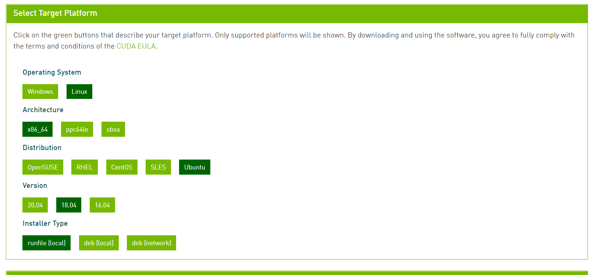

# 深度学习系统运行环境配置
## 目录 
- [NVIDIA驱动程序安装](#NVIDIA驱动程序安装)
- [CUDA与cuDNN](#CUDA与cuDNN)
- [单独准备python环境](#单独准备python环境)
- [opencv库安装](#opencv库安装)
- [安装PyTorch](#安装PyTorch)
- [安装TensorFlow](#安装TensorFlow)
- [安装Darknet](#安装Darknet)
- [demo](#demo)

---

**系统及各软件版本简介**

|系统或软件名称 | 版本号简述|
---------------|------------
|ubuntu|18.04|
|python|>=3.6|
|Tensorflow|>=1.13|
|Pytorch|>=1.4|
|darknet|yolov4|
|opencv|>=3.4|
|CUDA|>=9.0|
|cuDNN|7.6|

---

本文以NVIDIA公司的GPU产品为主要硬件计算设备，对一些基本的深度学习应用程序的运行环境配置进行简单说明，并使用一些简单的测试案例进行验证。

**进行驱动程序安装及基础工具配置，建议直接由root用户完成！！**

若是自己在官网安装的linux系统版本，需要自行换源到国内镜像，简单命令如下：
*若是需要详细了解相关内容，请自行搜索相关资料*

以ubuntu18.04为例

`vim /etc/apt/sources.list`

添加如下内容：
以阿里源为例：

```
deb http://mirrors.aliyun.com/ubuntu/ bionic main restricted universe multiverse 
deb http://mirrors.aliyun.com/ubuntu/ bionic-security main restricted universe multiverse 
deb http://mirrors.aliyun.com/ubuntu/ bionic-updates main restricted universe multiverse 
deb http://mirrors.aliyun.com/ubuntu/ bionic-proposed main restricted universe multiverse 
deb http://mirrors.aliyun.com/ubuntu/ bionic-backports main restricted universe multiverse 
deb-src http://mirrors.aliyun.com/ubuntu/ bionic main restricted universe multiverse 
deb-src http://mirrors.aliyun.com/ubuntu/ bionic-security main restricted universe multiverse 
deb-src http://mirrors.aliyun.com/ubuntu/ bionic-updates main restricted universe multiverse 
deb-src http://mirrors.aliyun.com/ubuntu/ bionic-proposed main restricted universe multiverse 
deb-src http://mirrors.aliyun.com/ubuntu/ bionic-backports main restricted universe multiverse
```
保存后退出即可

----

##  NVIDIA驱动程序安装
*对于新机器，需要检查有没有安装其他的显卡驱动程序，如果有，则需要全部清理，重新安装官方驱动！！！*
```
lshw -numeric -C display #查看当前电脑的显卡型号 
lsmod | grep nouveau #查看nouveau驱动是否使用 
lspci | grep VGA # 查看集成显卡 
lspci | grep NVIDIA # 查看NVIDIA显卡
```

**禁用nouveau驱动**
禁用之后重新启动机器
**清理之前安装的NVIDIA的驱动**
`sudo apt-get remove –purge nvidia`
完成清理之后重启机器

安装Ubuntu源的nvidia驱动，如430版本
`sudo apt install nvidia-driver-430`
安装完之后，执行
`nvidia-smi`
查看输出信息

---


## CUDA与cuDNN
[CUDA:  https://developer.nvidia.com/cuda-toolkit](https://developer.nvidia.com/cuda-toolkit)

CUDA 是NVIDIA官方开发的专用GPU计算的工具，目的是更好的支持GPU做大量的并行计算任务，并且进一步优化内存使用，提高设备利用率！

[cuDNN: https://developer.nvidia.com/cudnn](https://developer.nvidia.com/cudnn)

cuDNN 库则是官方开发人员应对深度学习的深度神经网络所开发的专用加速库，内置了非常多的加速支持，如各种高效的卷积运算实现方式等。
目前的CUDA 版本已经到了11.0，对应的cuDNN也已经到了8.0.1,由于发展比较快速，我们使用之前的稳定版本进行测试。

cuda10.0   cuDNN 7.6.5



选择runfile文件安装方式直接执行，例如：
```
wget https://developer.download.nvidia.com/compute/cuda/11.0.3/local_installers/cuda_11.0.3_450.51.06_linux.runsudo 
sh cuda_11.0.3_450.51.06_linux.run
```
根据提示，安装完成以后，添加相应的系统环境变量
```
sudo vim ~/.bashrc
#添加以下内容：
	#CUDA_HOME是系统默认安装路径，当然具体以你选择的安装路径为准
    export CUDA_HOME=/usr/local/cuda-10.0
    export LD_LIBRARY_PATH=${CUDA_HOME}/lib64
    export  PATH=${CUDA_HOME}/bin:${PATH}
```
cudnn下载地址：https://developer.nvidia.com/rdp/cudnn-archive#a-collapse765-10
下载完成之后将文件解压，拷贝到对应的文件夹中即可！
```
sudo cp cuda/include/cudnn.h /usr/local/cuda/include
sudo cp cuda/lib64/libcudnn* /usr/local/cuda/lib64
sudo chmod a+r /usr/local/cuda/include/cudnn.h /usr/local/cuda/lib64/libcudnn*
```
验证测试
可以选择安装时自带的测试案例进行验证，如
```
cd /usr/local/cuda-10.0/samples/1_Utilities/deviceQuery
sudo make
./deviceQuery #输出GPU的设备信息，则说明cuda和cudnn安装成功
```
至此，CUDA与cuDNN库已成功安装完毕！！！

----
## 单独准备python环境
确认自己的系统中内置的python版本，目前python2已经不再更新维护，python3已经到了3.8，使用者应该根据自己的编程习惯，合理选择版本号以便更好的进行开发工作！
### 更新pip
[说明文档 https://pip.pypa.io/en/stable/installing/](https://pip.pypa.io/en/stable/installing/)
```
curl https://bootstrap.pypa.io/get-pip.py -o get-pip.py
python get-pip.py
```
### pip换源
```bash
# 清华源为例
pip config set global.index-url https://pypi.tuna.tsinghua.edu.cn/simple
```

### 安装conda支持
直接安装对应的anaconda版本

[下载地址：https://www.anaconda.com/products/individual#linux](https://www.anaconda.com/products/individual#linux)
[安装说明：https://docs.anaconda.com/anaconda/install/linux/](https://docs.anaconda.com/anaconda/install/linux/)
### conda换源
`vim ~/.condarc`
写入以下配置，以清华源为例：
```
channels:
  - https://mirrors.tuna.tsinghua.edu.cn/anaconda/pkgs/main/
  - https://mirrors.tuna.tsinghua.edu.cn/anaconda/pkgs/free/
  - https://mirrors.tuna.tsinghua.edu.cn/anaconda/cloud/conda-forge/
  - https://mirrors.tuna.tsinghua.edu.cn/anaconda/cloud/pytorch/
ssl_verify: true
```
保存后提出！！

------
**注：后文使用pip或者conda都需要保证其是最新版本，关于如何更新，请自行查阅相关资料升级工具包**
## opencv库安装
在图像处理领域，opencv库是必不可少的支持工具，其最新版本已经集成了很多重要的算法，包括对DNN的支持！
*当然安装配置编译opencv库是非常麻烦的，若是我们只需要python支持，只需使用pip一行命令解决，但若是需要更多语言的接口，如C 、C++等，就需要源码编译*
### python单独版
只安装python支持包，需要提前安装好其他的支持包，如numpy、matplotlib等
```
#保证pip是最新的版本
#使用命令  pip install <需要的包>  安装需要的包
pip install opencv-python
```
安装完成以后可以简单的测试
```
#命令行输入
python
#进入python环境
import cv2
#没有报错，则是安装成功！
```

### 源码编译
*比较繁琐，稍后在更新*

-------
**注：下面安装的深度学习框架都是支持GPU版本的，若是只安装CPU版的，需自行到官网查阅相关文档说明，其实安装CPU版的更简单直接！**
## 安装TensorFlow
[官网安装说明：https://www.tensorflow.org/install](https://www.tensorflow.org/install)
*目前TensorFlow已经到了2.0版本，并且与1.0系列的编程模式稍有不同，初学者可能需要二选一，再认真学习*
依旧是两种方式，python版本和源码编译
### python版
直接使用pip
```
pip install tensorflow
```
或者指定版本
```
pip install tensorflow-gpu==1.15  #GPU
```
当然使用conda也是相同效果，如：
```
conda install tensorflow
```

### 源码编译
*较为复杂，以后再更新*

### 案例测试
[官网教程：https://tensorflow.google.cn/tutorials/keras/classification](https://tensorflow.google.cn/tutorials/keras/classification)

---
## 安装PyTorch
[官网：https://pytorch.org/](https://pytorch.org/)
### python版
使用pip
`pip install torch torchvision`
使用conda
```
conda install pytorch torchvision cudatoolkit=10.2 -c pytorch
```
### c++/java版
*暂时不更新*


### 案例测试
[官方中文教程：https://pytorch.apachecn.org/docs/1.4/](https://pytorch.apachecn.org/docs/1.4/)
如： TorchVision 对象检测微调教程
[https://pytorch.apachecn.org/docs/1.4/8.html](https://pytorch.apachecn.org/docs/1.4/8.html)

## 安装Darknet
安装darknet需要提前完成CUDA、cuDNN安装，opencv源码编译安装，最新的yolov4还有很多新的配置优化等选项，具体看个人系统配置要求！
详情请参考：[AlexeyAB/darknet](https://github.com/AlexeyAB/darknet)


## demo
本文寻找了一些有趣的案例，他们基于Tensorflow或PyTorch等其他框架，当然基于什么并不重要，目前的框架基本大同小异，熟悉框架，可以让我们更好的使用它实现我们自己的网络结构及算法思路，并且借助框架的力量，使得对计算和数据资源的使用更加高效可靠！

*待更新*
