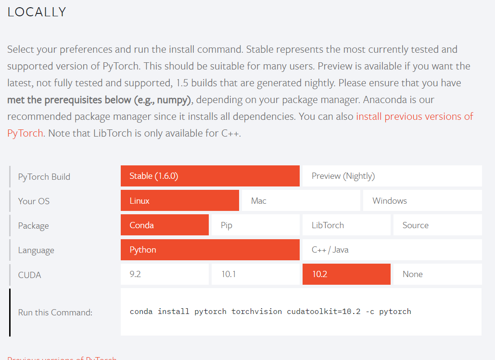

# 如何安装pytorch

[官网：https://pytorch.org/](https://pytorch.org/)



### python版

使用pip

`pip install torch torchvision`

使用conda
```
conda install pytorch torchvision cudatoolkit=10.2 -c pytorch
```
### c++/java版

*暂时不更新*


### 案例测试
[官方中文教程：https://pytorch.apachecn.org/docs/1.4/](https://pytorch.apachecn.org/docs/1.4/)

如： TorchVision 对象检测微调教程
[https://pytorch.apachecn.org/docs/1.4/8.html](https://pytorch.apachecn.org/docs/1.4/8.html)


